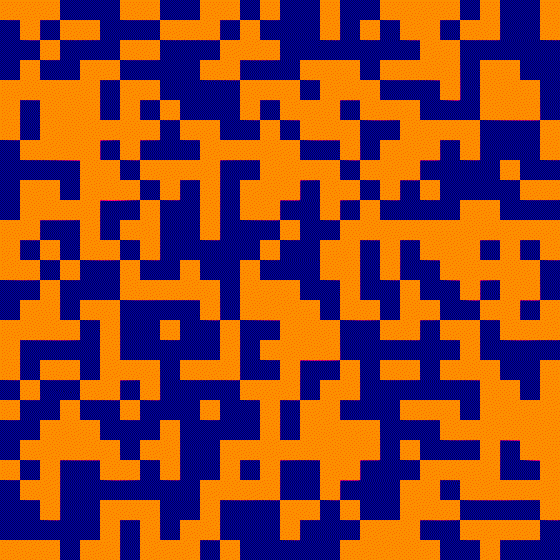

# Hopfield_with_JAX

Experiments to confirm my understanding of Hopfield networks using JAX. 

I read [Neural networks and physical systems with emergent collective computational abilities](https://www.pnas.org/doi/epdf/10.1073/pnas.79.8.2554) which is full of fantastic insights:

    John Hopfield already predicts the uses for silicon solutions: "The model could be readily implemented by integrated circuit hardware."

I also really appreciate this part mentioning the ideas behind time-delay computing that are emerging:

    "Perceptron modeling required synchronous neurons like a conventional digital computer. There is no evidence for such global synchrony and, given the delays of nerve signal propagation, there would be no way to use global synchrony effectively. Chiefly computational properties which can exist in spite of asynchrony have interesting implications in biology" - John Hopfield

`hopfield.ipynb` contains the most basic version, where the weight between two neurons is equal. Hopfield mentions these networks being robust to remove various connections $(T_{i,j} = 0)$

It's very interesting to see that the behavious of these seem extremely similar to diffusion models and flow-based models too.
